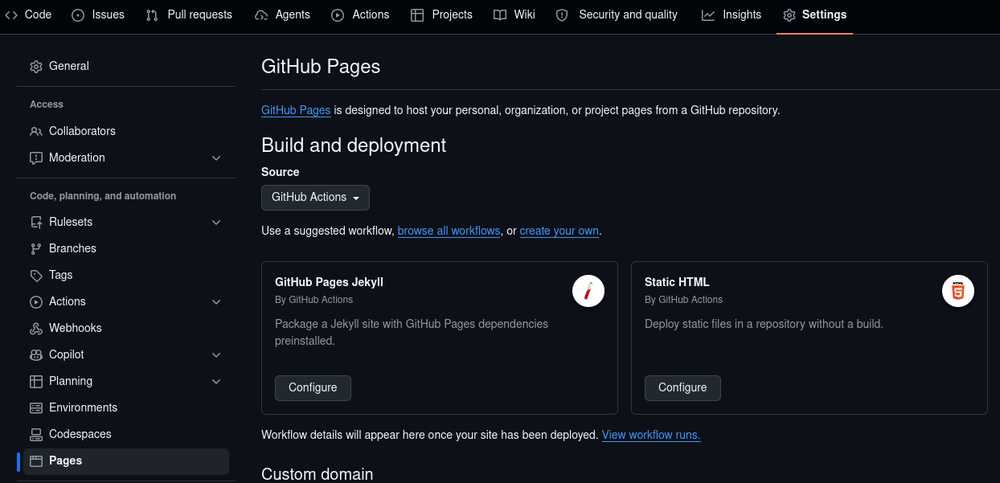

# Build the docs using sphinx

You can build the [sphinx](https://www.sphinx-doc.org) based docs from the project directory by running:

```
$ tox -e docs
```

This will build the static docs on the `docs` directory, which includes API docs that pull in docstrings from the code.

:::{seealso}
[](documentation_standards)
:::

The docs will be built into the `build/html` directory, and can be opened locally with a web browse:

```
$ firefox build/html/index.html
```

## Autobuild

You can also run an autobuild process, which will watch your `docs` and `src` directories for changes and rebuild whenever it sees changes, reloading any browsers watching the pages:

```
$ tox -e docs-autobuild
```

You can view the pages at localhost:

```
$ firefox http://localhost:8000
```

If you want to watch additional directories for changes you can pass these as argument to tox:

```
$ tox -e docs-autobuild -- --watch tests
```

(building-docs-in-ci)=
## Building docs in CI

Docs are built using the [myst-version-switcher-plugin](https://github.com/DiamondLightSource/myst-version-switcher-plugin). 

After a successful run of CI

Settings > Pages



If your repo was using the ```gh-pages``` branch to publish docs, follow the [migration instructions](https://diamondlightsource.github.io/myst-version-switcher-plugin/main/how-to/) to now use Github Actions. 
