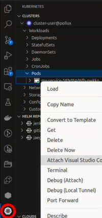

# Debug a container within a cluster

The container build also publishes a debug container for each tagged release of the container with the tag suffixed with `-debug`. This container contains the workspace and has an alternative entrypoint which allows the devcontainer to attach: if you have configured a `livenessProbe` that requires the service to have started it should be disabled. The container also installs debugpy and makes the service install editable. Any custom `command` or `args` defined for the container should be disabled.

With the [Kubernetes plugin for vscode](https://marketplace.visualstudio.com/items?itemName=ms-kubernetes-tools.vscode-kubernetes-tools) it is then possible to attach to the container inside the cluster. This may require that your targeted kubeconfig is at `~/.kube/config`, rather than referenced from the environment variable `KUBECONFIG`. It may also be necessary to [add additional contextual information](https://kubernetes.io/docs/reference/kubectl/generated/kubectl_config/kubectl_config_set-context/), such as the namespace.


The Kubernetes plugin can be found in the plugin bar. Expanding the Clusters>`cluster`>Workloads>Pods views, your service should be visible. Right Click>Attach Visual Studio Code will initiate connecting to the workspace in the cluster. Select your service container from the top menu when prompted.

After the connection to the cluster has been established, it may be necessary to open the workspace folder by clicking the Explorer option in the plugin bar, the repository will be mounted at `/workspaces/<service name>`, equivalent to when working with a local devcontainer.

Starting your service with the command in the container definition starts it on the node, with access to Kubernetes resources, however it is also now possible to run with or attach a debugger, potentially configured to autoReload code, or to start and stop the service rapidly to implement prospective changes.

After you are happy with the changes, commit them and release a new version of your container. Changes will otherwise not be persisted across container restarts. Your git and ssh config will be mounted inside the devcontainer while connected and for containers on github, the remote `origin` will be configured to use ssh.

## Debugging containers that run as non-root
For containers running in the Diamond Kubernetes infrastructure that run as a specific uid (e.g. if mounting the filesystem), it is required to use a sidecar container to provide name resolution from Diamond's LDAP infrastructure and to mount a home directory to house vscode plugins. 

A sidecar for the Debian-based Python image this template uses is published as a container from this repository, the version should match the version of the python-copier-template you are using, to ensure compatibility with the underlying container infrastructure.

```yaml
- name: debug-account-sync
  image: ghcr.io/diamondlightsource/python-copier-template/account-sync:<version>
  volumeMounts:
  # The nslcd socket will be shared between the service and the sidecar
  - mountPath: /var/run/nslcd
    name: nslcd
```

The following changes/additions to your `values.yaml` may be required to connect vscode when using the sidecar.
It is recommended to set the `HOME` environment variable on your container to be debugged to the same value used in the volume below.

```yaml
volumes:
- name: home  # Required for vscode to start and install plugins
  hostPath:
    path: /home/<fedid>
- name: nslcd  # Shared volume between main and sidecar container
  emptyDir:
    sizeLimit: 500Mi

volumeMounts:
- mountPath: /home/<fedid>
  name: home
- mountPath: /var/run/nslcd
  name: nslcd

# Disable any liveness probe, as will not start service automatically
livenessProbe: null
readinessProbe: null

# Required to mount /home/, /dls/ etc.
podSecurityContext:
  runAsUser: <uid of fedid>
  runAsGroup: <gid of fedid>

image:
  tag: "<version>-debug"
```
