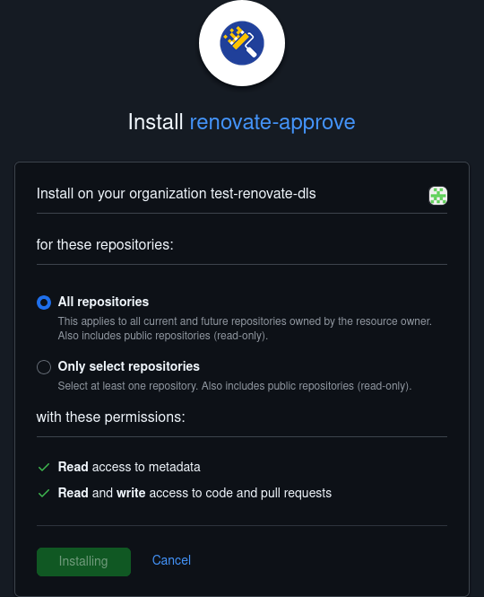

# Use renovate to keep dependencies up to date

[Renovate](https://github.com/apps/renovate) is a tool for automating dependency updates. It is used to:
- Automatically update the [uv lock file](./lock-requirements.md) and automerge if tests pass
- Update any dependencies in the Dockerfile
- Update the versions of any GitHub actions not manager by the python-copier-template

## Install the Renovate GitHub app

The renovate app will:
- Create weekly PRs to update the lockfile to the latest versions, automerging if tests pass
- Create PRs for other dependencies whenever they are released, but not automerge

If your repo is hosted in the DiamondLightSource org, then the Renovate GitHub app is already installed so you don't need to do anything.

If your repo is in an org where the Renovate GitHub app is not installed, then follow these steps to install it on the org:

- Visit https://github.com/apps/renovate
- Click `Configure`
- Select the org your repo is hosted in
- Select `All repositories` and click `Install`
- Select `Renovate Only` as the product
- Select `Silent` as the mode
- Click `Finish`
- Click `Settings`
- Select the `Dependencies` tab
- Uncheck `Silent mode`, uncheck `Create onboarding PRs`, and click `Save`
- Visit https://github.com/apps/renovate-approve
- Click `Configure`
- Select the org your repo is hosted in
- Select `All repositories` and click `Install`

Renovate will now run periodically to check for updates.
 
## Pin the dependency dashboard issue

Renovate will create a dependency dashboard when it first runs, this is the way you interact with the bot, requesting it to re-run. It is recommended that you pin this issue to your repo so you can find it easily. Select `Pin issue` in the right hand bar of the issue to do this.
